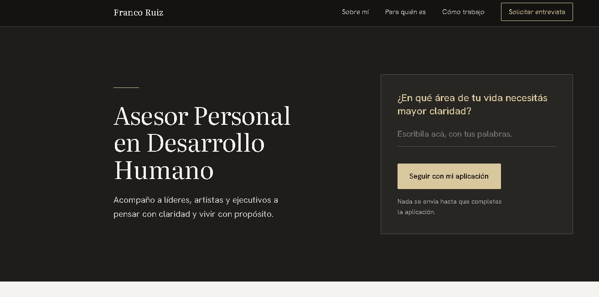
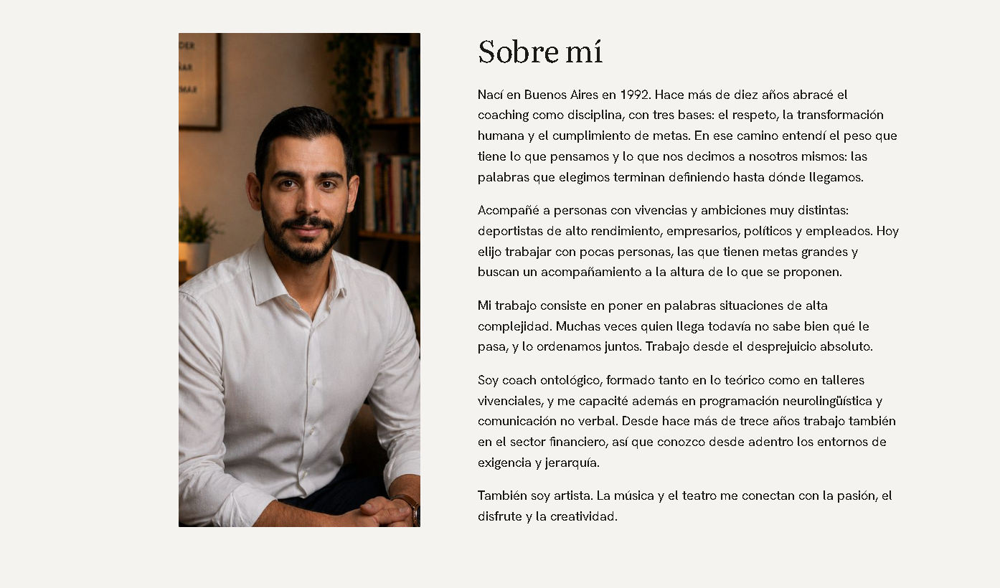
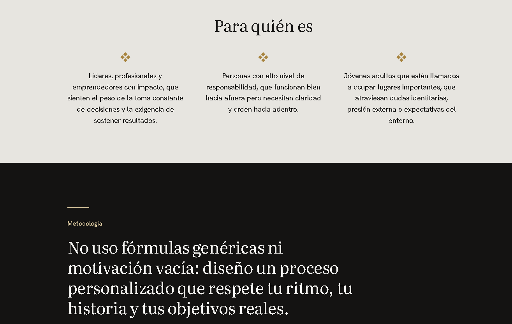
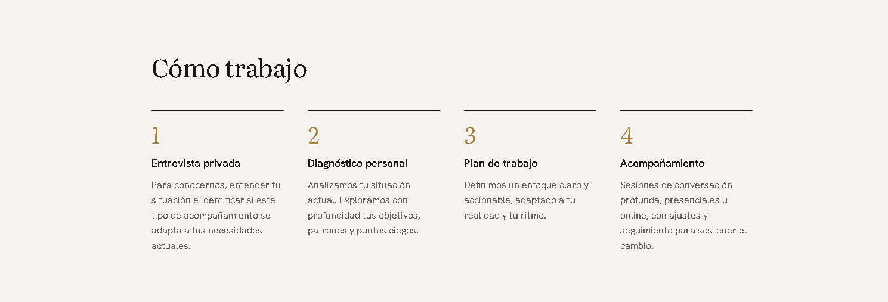
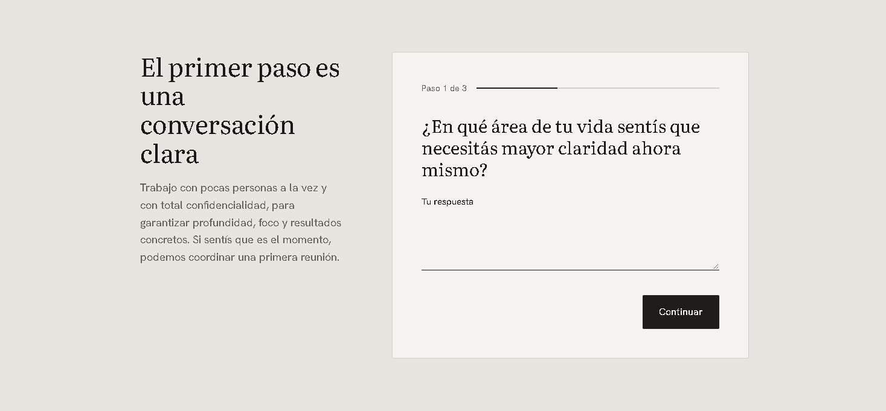

# Personal Coaching Website

Custom WordPress theme for [francoruiz.net](https://francoruiz.net), the website of my personal development coaching practice. It replaces an earlier version built on a stock WordPress theme with a form plugin.

## Overview

A single-page site built to do one thing: turn a qualified visitor into an application. The page opens with a question the visitor can answer on the spot, and that answer becomes the first step of a three-step application form.

I defined the positioning, content, page structure and every design decision, and implemented the theme through AI-assisted development with Claude, iterating on live previews until each section was approved.

## Features

- Hero with an inline question whose answer is carried into the application form
- Three-step application form with client-side validation and a progress indicator
- Applications stored in the WordPress admin as a private custom post type, with a read-only detail view
- Email notification for each application, with Reply-To set to the applicant
- Spam protection without third-party services: honeypot field, minimum completion time and per-IP rate limiting
- Server-side sanitization and validation of every field
- Responsive layout, keyboard focus styles and reduced-motion support
- No plugins or page builders required

## Tech Stack

- WordPress (custom theme, no parent theme)
- PHP: custom post type, AJAX handler, admin columns and meta box
- Vanilla JavaScript, no dependencies
- CSS with custom properties
- Hosted on SiteGround

## Structure

```
theme/
  style.css          Theme header and all styles
  functions.php      Assets, custom post type, form handler, admin views
  front-page.php     Page markup
  index.php          Fallback that renders the same page
  assets/js/main.js  Multi-step form logic
  assets/img/        Images
```

## Setup

1. Set the notification address in `theme/functions.php` (`FR_NOTIFY_EMAIL`).
2. Zip the `theme` folder and upload it in WordPress under Appearance > Themes > Add New > Upload Theme.
3. Activate it. Applications appear under the Applications menu ("Aplicaciones") in the admin.

## Live Site

[francoruiz.net](https://francoruiz.net)

## Preview










